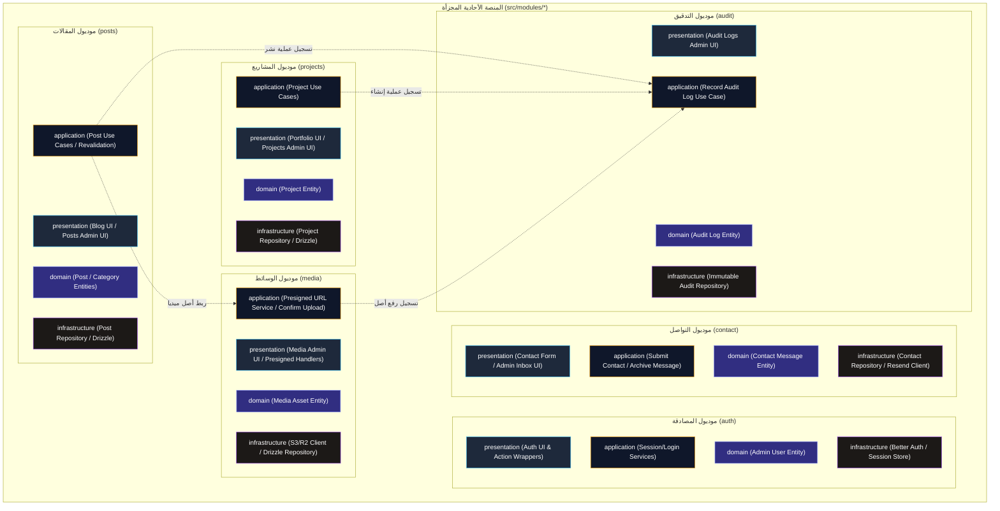
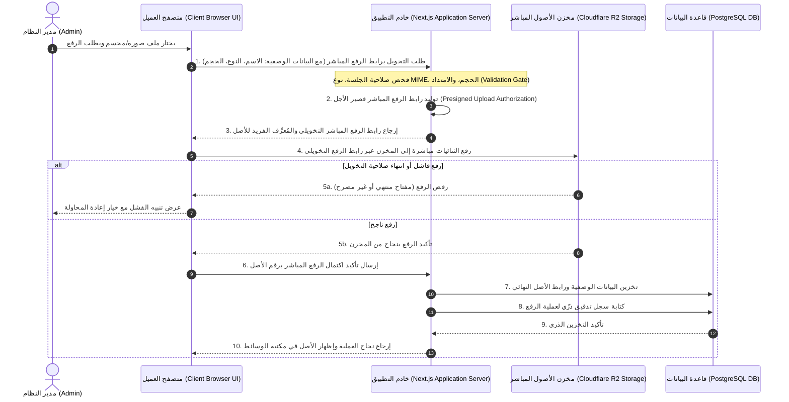

# خريطة سياق المعمارية (Architecture Context Map)

## 1. مخطط سياق النظام الخارجي (System Context Diagram)

يوضح هذا المخطط العلاقة بين العناصر والجهات الخارجية (الزائر، الأدمن عبر متصفح العميل، خادم المنصة، قاعدة البيانات PostgreSQL، مخزن R2، ومزود البريد الخياري Resend).

```mermaid
graph TD
    subgraph External_Actors ["الفاعلون الخارجيون والتطبيقات (Actors & Clients)"]
        Visitor["الزائر (Visitor / Public User)"]
        Admin["مدير النظام (Admin User)"]
        AdminBrowser["متصفح العميل الإداري (Admin Client Browser)"]
    end

    subgraph Core_Platform ["منصة الموقع الشخصي (Portfolio Platform)"]
        AppServer["خادم التطبيق الأحادي المجزأ (Next.js Application Server)"]
    end

    subgraph External_Services ["الخدمات والبنية التحتية (Infrastructure Services)"]
        PostgresDB[("قاعدة البيانات الرئيسية (PostgreSQL DB)")]
        R2Storage[("مخزن الأصول المباشر (Cloudflare R2 Storage)")]
        EmailProvider["مقدم خدمة البريد (Resend Email Service - Optional)"]
    end

    %% Interactions
    Visitor -->|"1. تصفح الخدمات/المشاريع/المدونة والتواصل"| AppServer
    Admin -->|"2. إدارة النطاقات وتفاصيل المحتوى"| AdminBrowser
    AdminBrowser -->|"3. إرسال طلبات المصادقة وإدارة المحتوى والوسائط"| AppServer

    AppServer -->|"4. الاستعلام والتخزين الذري للبيانات والسجلات"| PostgresDB
    AppServer -->|"5. إصدار روابط الرفع المباشرة (Presigned URLs)"| AdminBrowser

    AdminBrowser -->|"6. رفع أصول الميديا مباشرة (Direct Binary Upload)"| R2Storage
    Visitor -->|"7. استعراض وقراءة صور وأصول الميديا العامة"| R2Storage

    AppServer -.->"8. إرسال إشعارات الرسائل الواردة (اختياري)"| EmailProvider

    %% Styling
    classDef actorStyle fill:#1e293b,stroke:#38bdf8,stroke-width:2px,color:#fff;
    classDef appStyle fill:#0f172a,stroke:#f59e0b,stroke-width:3px,color:#fff;
    classDef storageStyle fill:#312e81,stroke:#818cf8,stroke-width:2px,color:#fff;

    class Visitor,Admin,AdminBrowser actorStyle;
    class AppServer appStyle;
    class PostgresDB,R2Storage,EmailProvider storageStyle;
```

---

## 2. خريطة الوحدات والطبقات الداخلية (Internal Module Map)

توضح هذه الخريطة الهيكلية تقسيم الوحدات الوظيفية الست (`auth`, `posts`, `projects`, `media`, `contact`, `audit`) وطبقات كل موديول (`domain`, `application`, `infrastructure`, `presentation`).



---

## 3. تدفق البيانات ورفع الوسائط المباشر (Data & Direct Media Upload Flow)

يرسم هذا التخطيط التسلسلي نمط رفع أصول الوسائط المباشر عبر **Presigned URL** باستخدام المفهوم الإجرائي (محتوى العقود والروابط البرمجية يُحدد لاحقاً في وثيقة عقود الـ API)، مؤكداً عدم مرور الملفات الثنائية عبر خادم التطبيق إطلاقاً وحفظ البيانات الوصفية فقط في PostgreSQL.


