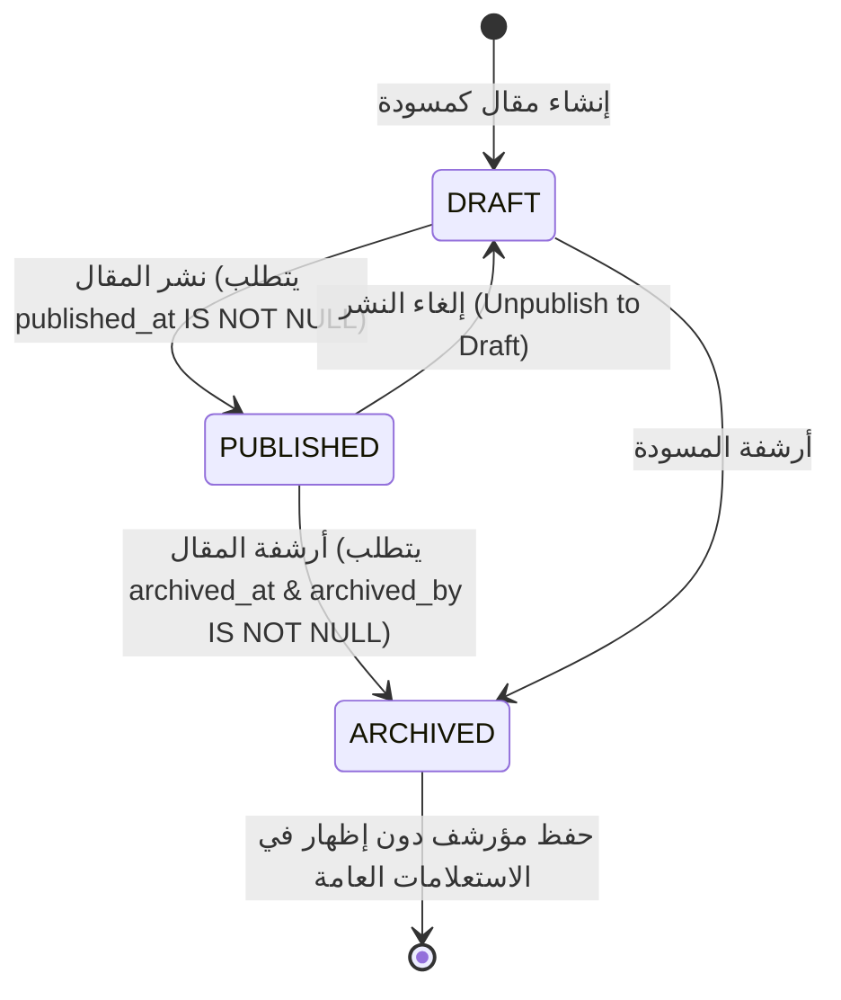
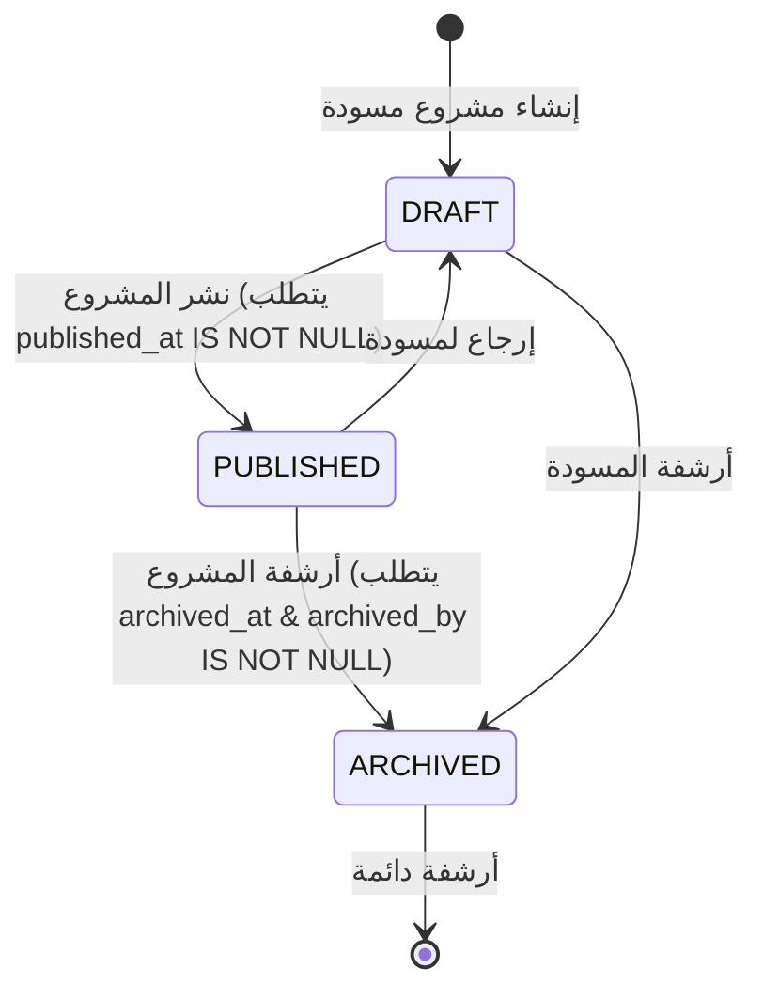
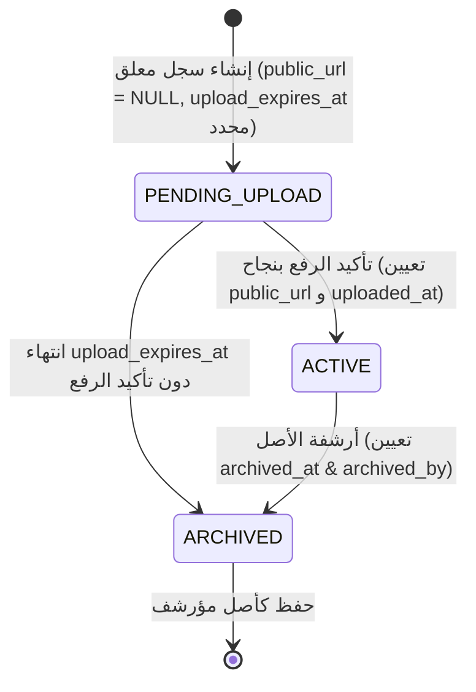
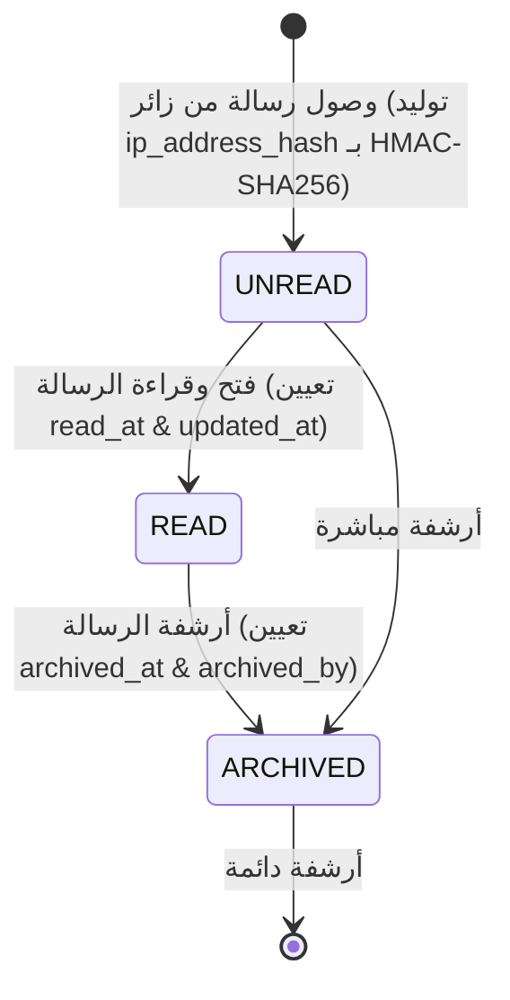
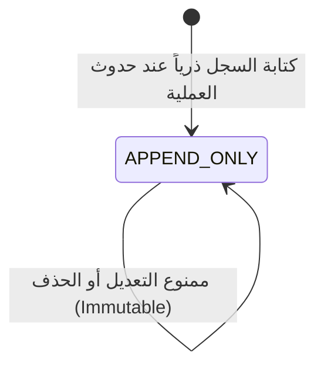

# دليل دورة حياة البيانات والانتقالات (Data Lifecycle Specification)

## 1. نظرة عامة

يحدد هذا المستند الآلات الحالية للحالة (State Machines)، والقيود الصارمة للانتقالات، ومسؤولي الانتقالات للكيانات الأساسية في قاعدة البيانات بعد استيفاء شروط سلامة رفع الوسائط والرسائل والحسابات.

---

## 2. آلات الحالة ودورة الحياة لكل كيان (Entity State Machines)

### 2.1 دورة حياة المقال (`Post Lifecycle`)

- **الحالات المسموحة**: `DRAFT`, `PUBLISHED`, `ARCHIVED`
- **المسؤول المأذون**: `Admin`
- **قيود السلامة (Check Constraints)**:
  - `CHECK (status != 'PUBLISHED' OR published_at IS NOT NULL)`
  - `CHECK (status != 'ARCHIVED' OR (archived_at IS NOT NULL AND archived_by_user_id IS NOT NULL))`
- **الانتقالات المسموحة**:
  - `DRAFT` → `PUBLISHED` (تعيين `published_at`, `updated_at` وسجل تدقيق `PUBLISH_POST`).
  - `PUBLISHED` → `DRAFT` (إعادة المقال كمسودة وحجبه عن العامة).
  - `PUBLISHED` → `ARCHIVED` (تعيين `archived_at`, `archived_by_user_id`, `updated_at`).
  - `DRAFT` → `ARCHIVED` (أرشفة المسودة وتحديث التوقيع الزمني).
- **الانتقالات المحظورة**:
  - `ARCHIVED` → `PUBLISHED`
  - حذف السجل نهائياً (`DELETE`).

---

### 2.2 دورة حياة المشروع (`Project Lifecycle`)

- **الحالات المسموحة**: `DRAFT`, `PUBLISHED`, `ARCHIVED`
- **المسؤول المأذون**: `Admin`
- **قيود السلامة (Check Constraints)**:
  - `CHECK (status != 'PUBLISHED' OR published_at IS NOT NULL)`
  - `CHECK (status != 'ARCHIVED' OR (archived_at IS NOT NULL AND archived_by_user_id IS NOT NULL))`

---

### 2.3 دورة حياة الوسائط والأصول (`Media Asset Lifecycle`)

تُستخدم صفوف `media_assets` نفسها كأرقام طلبات معلقة قبل إصدار رابط الرفع المباشر.

- **الحالات المسموحة**: `PENDING_UPLOAD`, `ACTIVE`, `ARCHIVED`
- **المسؤول المأذون**: `Admin` (الطلب والتأكيد) / خادم المنصة (الأرشفة عند انتهاء الصلاحية).
- **قيود السلامة (Check Constraints)**:
  - `CHECK (status != 'PENDING_UPLOAD' OR upload_expires_at IS NOT NULL)`
  - `CHECK (status != 'ACTIVE' OR (public_url IS NOT NULL AND uploaded_at IS NOT NULL))`
  - `CHECK (status != 'ARCHIVED' OR archived_at IS NOT NULL)`
- **الانتقالات المسموحة**:
  - `PENDING_UPLOAD` → `ACTIVE` (يحدث فقط عند تأكيد الرفع المباشر الناجح، وتحديث `public_url`, `uploaded_at`, `updated_at`).
  - `PENDING_UPLOAD` → `ARCHIVED` (يحدث تلقائياً عندما يتجاوز الوقت الحالي `upload_expires_at`).
  - `ACTIVE` → `ARCHIVED` (أرشفة الأصل وتحديث التوقيع الزمني).
- **الانتقالات المحظورة**:
  - `ARCHIVED` → `ACTIVE`
  - ربط الأصول ذات الحالة `PENDING_UPLOAD` أو `ARCHIVED` بأي مقال أو مشروع (يُسمح فقط بـ `ACTIVE`).

---

### 2.4 دورة حياة رسالة التواصل (`Contact Message Lifecycle`)

- **الحالات المسموحة**: `UNREAD`, `READ`, `ARCHIVED`
- **المسؤول المأذون**: الزائر (`UNREAD`) / `Admin` (`READ`, `ARCHIVED`).
- **قيود السلامة (Check Constraints)**:
  - `CHECK (status != 'READ' OR read_at IS NOT NULL)`
  - `CHECK (status != 'ARCHIVED' OR archived_at IS NOT NULL)`
- **الانتقالات المسموحة**:
  - `UNREAD` → `READ` (عند قراءة الأدمن للرسالة، تعيين `read_at = CURRENT_TIMESTAMP`, `updated_at = CURRENT_TIMESTAMP`).
  - `READ` → `ARCHIVED` (نقل الرسالة للأرشيف، تعيين `archived_at`, `archived_by_user_id`, `updated_at`).
  - `UNREAD` → `ARCHIVED` (أرشفة غير المقروء).
- **الانتقالات المحظورة**:
  - `ARCHIVED` → `UNREAD`
  - حذف الرسالة نهائياً (`DELETE`).

---

### 2.5 دورة حياة سجل التدقيق (`Audit Log Lifecycle`)

- **الحالة المسموحة**: `APPEND_ONLY`
- **السياسة الصارمة**:
  - **يُسمح فقط بـ**: `INSERT`
  - **يُحظر تماماً**: `UPDATE`, `DELETE`, `TRUNCATE`
