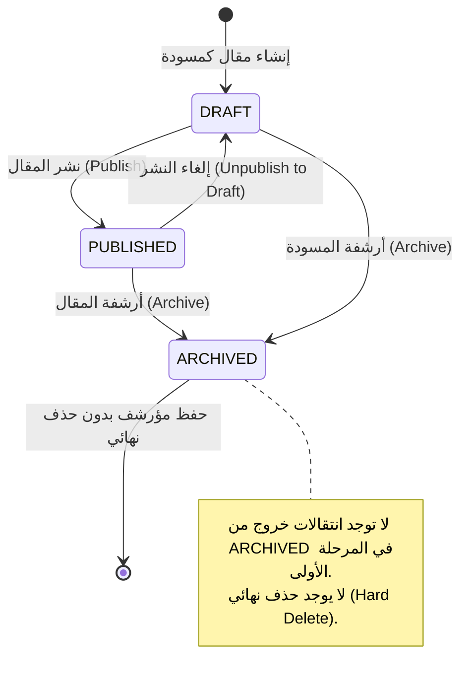
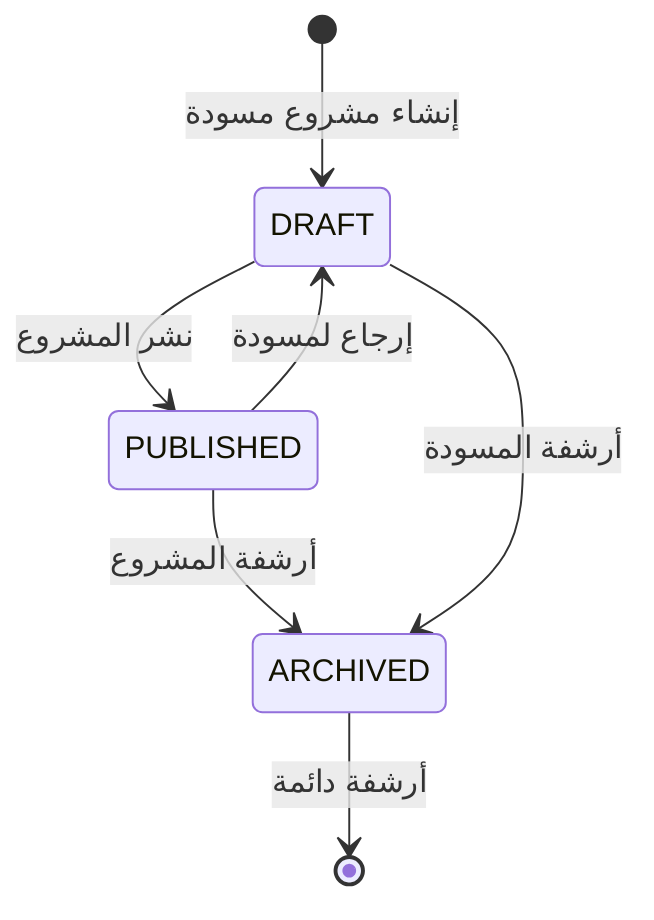
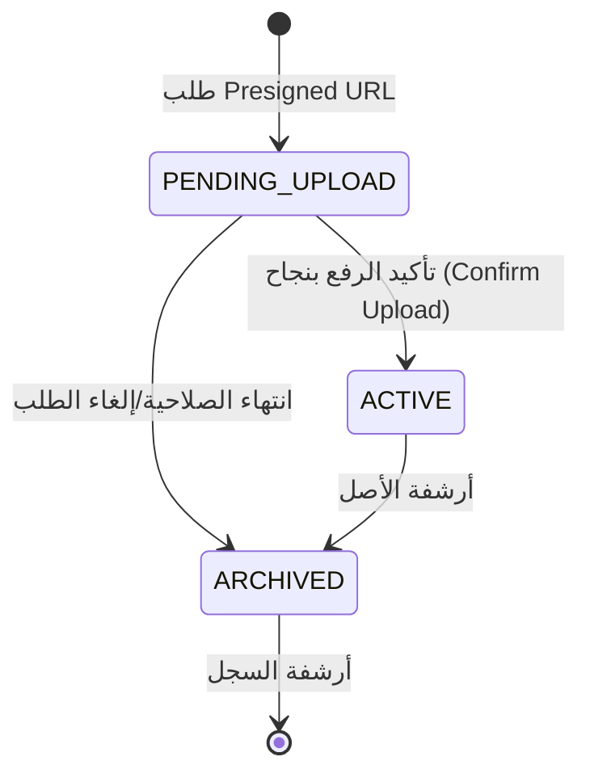
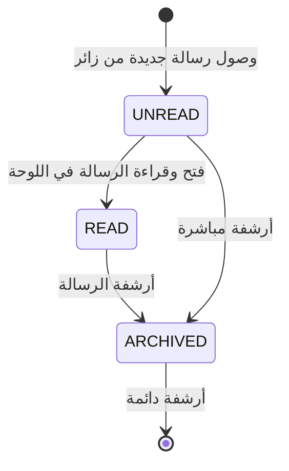
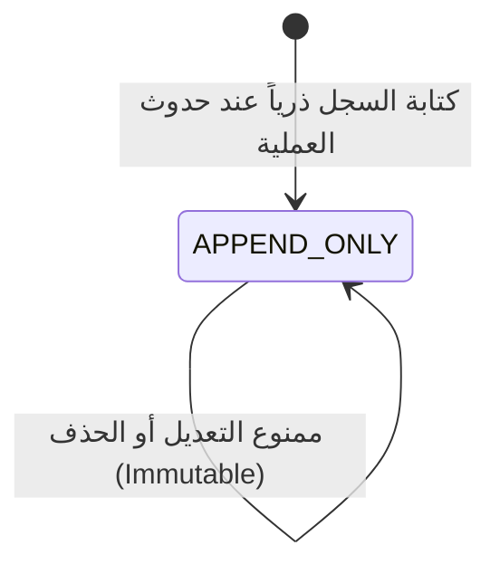

# دليل دورة حياة البيانات والانتقالات (Data Lifecycle Specification)

## 1. نظرة عامة

يحدد هذا المستند الآلات الحالية للحالة (State Machines)، والقيود الصارمة للانتقالات، ومسؤولي الانتقالات للكيانات الأساسية في قاعدة البيانات.

---

## 2. آلات الحالة ودورة الحياة لكل كيان (Entity State Machines)

### 2.1 دورة حياة المقال (`Post Lifecycle`)

- **الحالات المسموحة**: `DRAFT`, `PUBLISHED`, `ARCHIVED`
- **المسؤول المأذون (Transition Owner)**: `Admin` (عبر أدوات التحكم المصادق عليها فقط).
- **الانتقالات المسموحة**:
  - `DRAFT` → `PUBLISHED` (نشر المقال وتنشيط الكاش وكتابة سجل تدقيق `PUBLISH_POST`).
  - `PUBLISHED` → `DRAFT` (إعادة المقال كمسودة وحجبه عن العامة).
  - `PUBLISHED` → `ARCHIVED` (أرشفة المقال وتعيين `archived_at` وسجل تدقيق `ARCHIVE_POST`).
  - `DRAFT` → `ARCHIVED` (أرشفة المسودة وتعيين `archived_at`).
- **الانتقالات المحظورة (Forbidden Transitions)**:
  - `ARCHIVED` → `PUBLISHED` (محظور في المرحلة الأولى ريثما تحدد سياسة الاستعادة).
  - أي انتقال يتضمن حذف السجل من قاعدة البيانات (`DELETE`).

---

### 2.2 دورة حياة المشروع (`Project Lifecycle`)

- **الحالات المسموحة**: `DRAFT`, `PUBLISHED`, `ARCHIVED`
- **المسؤول المأذون**: `Admin`
- **الانتقالات المسموحة**:
  - `DRAFT` → `PUBLISHED`
  - `PUBLISHED` → `DRAFT`
  - `PUBLISHED` → `ARCHIVED`
  - `DRAFT` → `ARCHIVED`
- **الانتقالات المحظورة**:
  - `ARCHIVED` → `PUBLISHED`
  - التعديل المباشر أو حذف السجل بشكل نهائي.

---

### 2.3 دورة حياة الوسائط والأصول (`Media Asset Lifecycle`)

- **الحالات المسموحة**: `PENDING_UPLOAD`, `ACTIVE`, `ARCHIVED`
- **المسؤول المأذون**: `Admin` (الطلب والتأكيد) / النظام (انتهاء الصلاحية الآلي).
- **الانتقالات المسموحة**:
  - `PENDING_UPLOAD` → `ACTIVE` (يحدث فقط عند استلام تأكيد الرفع المباشر الناجح من المخزن).
  - `PENDING_UPLOAD` → `ARCHIVED` (عند انتهاء صلاحية رابط الرفع دون تأكيد).
  - `ACTIVE` → `ARCHIVED` (أرشفة الأصل وتعيين `archived_at`).
- **الانتقالات المحظورة**:
  - `ARCHIVED` → `ACTIVE` (غير مسموح بإنعاش الملفات المؤرشفة صراحة).
  - مرر أي ثنائيات ملفات عبر التطبيق للتغيير.

---

### 2.4 دورة حياة رسالة التواصل (`Contact Message Lifecycle`)

- **الحالات المسموحة**: `UNREAD`, `READ`, `ARCHIVED`
- **المسؤول المأذون**: الزائر (الإنشاء في `UNREAD`) / `Admin` (القراءة والأرشفة).
- **الانتقالات المسموحة**:
  - `UNREAD` → `READ` (عند فتح الأدمن للرسالة في الصندوق الداخلي).
  - `READ` → `ARCHIVED` (عند نقل الرسالة لأرشيف الصندوق).
  - `UNREAD` → `ARCHIVED` (أرشفة الرسائل غير المقروءة).
- **الانتقالات المحظورة**:
  - `READ` → `UNREAD`
  - `ARCHIVED` → `UNREAD`
  - حذف الرسالة نهائياً من الصندوق (`Hard Delete`).

---

### 2.5 دورة حياة سجل التدقيق (`Audit Log Lifecycle`)

- **الحالة المسموحة**: `APPEND_ONLY`
- **المسؤول المأذون**: خادم التطبيق (تلقائياً أثناء تنفيذ حالات الاستخدام الإدارية).
- **السياسة الصارمة**:
  - **يُسمح فقط بـ**: `INSERT`
  - **يُحظر تماماً**: `UPDATE`, `DELETE`, `TRUNCATE`
