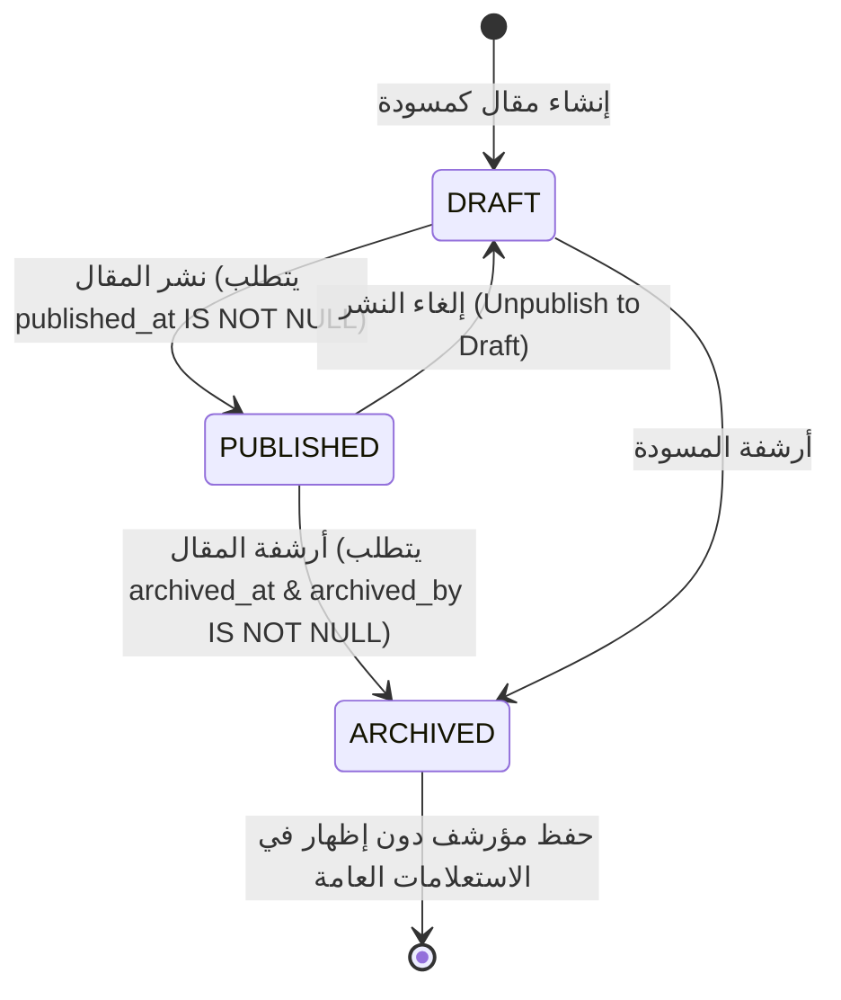
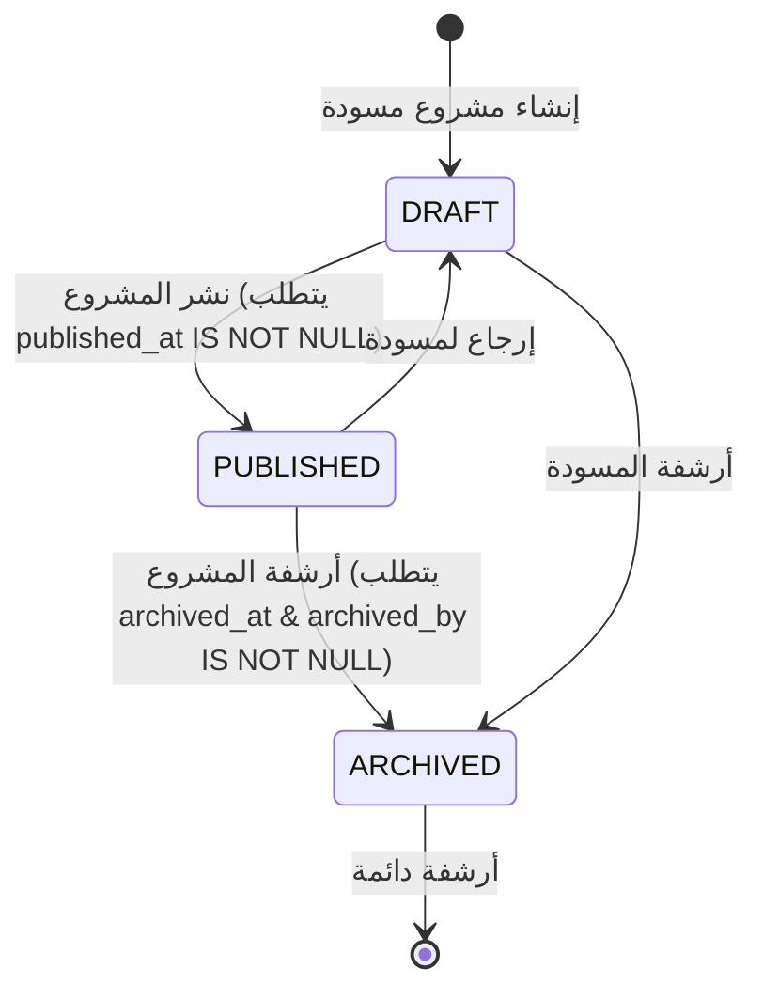
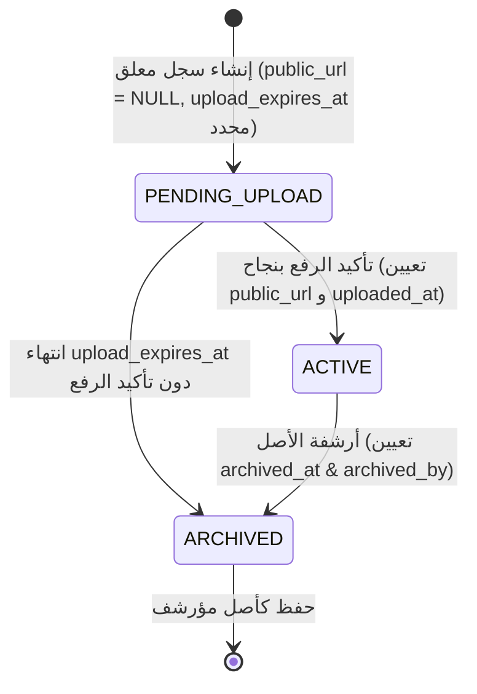
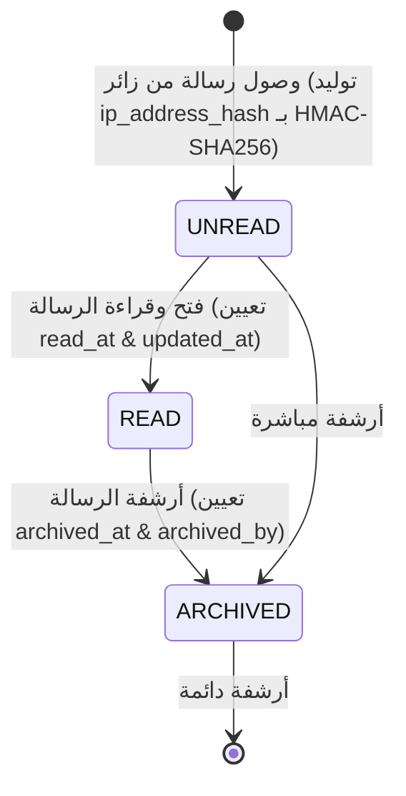
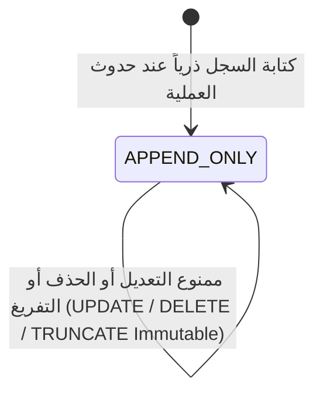

# دليل دورة حياة البيانات والانتقالات (Data Lifecycle Specification)

## 1. نظرة عامة

يحدد هذا المستند الآلات الحالية للحالة (State Machines)، والقيود الصارمة للانتقالات، ومسؤولي الانتقالات لجميع الكيانات الـ 16 في قاعدة البيانات (4 جداول Better Auth + 12 جدول بيانات).

---

## 2. آلات الحالة ودورة الحياة لكل كيان (Entity State Machines)

### 2.1 دورة حياة المقال (`Post Lifecycle`)

---

### 2.2 دورة حياة المشروع (`Project Lifecycle`)

---

### 2.3 دورة حياة الوسائط والأصول (`Media Asset Lifecycle`)

---

### 2.4 دورة حياة رسالة التواصل (`Contact Message Lifecycle`)

---

### 2.5 دورة حياة سجل التدقيق (`Audit Log Lifecycle`)

- **الحالة المسموحة**: `APPEND_ONLY`
- **السياسة الصارمة في PostgreSQL**:
  - **يُسمح فقط بـ**: `INSERT`
  - **يُحظر تماماً**: `UPDATE`, `DELETE`, `TRUNCATE` (مرفوضة بحرص عبر مشغلي DB على مستوى الصف للصفوف ومستوى العبارة للتفريغ).
