# مخطط كيانات وعلاقات قاعدة البيانات (Entity Relationship Diagram - ERD)

## 1. نظرة عامة

يقدم هذا المستند المخطط البصري الهيكلي لجميع الجداول الـ 13 المعتمدة في منصة الموقع الشخصي، موضحاً المفاتيح الرئيسية (PK)، المفاتيح الأجنبية (FK)، القيود، والصفات المحدثة لملف الرفع ورسائل التواصل والحماية.

---

## 2. مخطط العلاقات الإجمالي (Mermaid ER Diagram)

```mermaid
erDiagram

    users ||--o{ posts : "author_id (يكتب)"
    users ||--o{ posts : "archived_by_user_id (يؤرشف)"
    users ||--o{ projects : "archived_by_user_id (يؤرشف)"
    users ||--o{ media_assets : "uploaded_by_user_id (يرفع)"
    users ||--o{ media_assets : "archived_by_user_id (يؤرشف)"
    users ||--o{ contact_messages : "archived_by_user_id (يؤرشف)"
    users ||--o{ audit_logs : "actor_user_id (ينفذ)"

    categories ||--o{ posts : "category_id (يحتوي)"

    posts ||--o{ post_tags : "post_id"
    tags ||--o{ post_tags : "tag_id"

    projects ||--o{ project_technologies : "project_id"
    technologies ||--o{ project_technologies : "technology_id"

    posts ||--o{ post_media_assets : "post_id"
    media_assets ||--o{ post_media_assets : "media_asset_id"

    projects ||--o{ project_media_assets : "project_id"
    media_assets ||--o{ project_media_assets : "media_asset_id"

    users {
        uuid id PK
        varchar email UK
        varchar password_hash
        varchar full_name
        varchar role UK "CHECK role = ADMIN"
        timestamptz created_at
        timestamptz updated_at
    }

    categories {
        uuid id PK
        varchar name UK
        varchar slug UK
        text description
        timestamptz created_at
        timestamptz updated_at
    }

    posts {
        uuid id PK
        varchar title
        varchar slug UK
        text summary
        text content_markdown
        varchar status "CHECK DRAFT|PUBLISHED|ARCHIVED"
        uuid category_id FK
        uuid author_id FK
        timestamptz published_at
        timestamptz archived_at
        uuid archived_by_user_id FK
        timestamptz created_at
        timestamptz updated_at
    }

    tags {
        uuid id PK
        varchar name UK
        varchar slug UK
        timestamptz created_at
    }

    post_tags {
        uuid post_id PK, FK
        uuid tag_id PK, FK
    }

    technologies {
        uuid id PK
        varchar name UK
        varchar slug UK
        varchar icon_name
        timestamptz created_at
    }

    projects {
        uuid id PK
        varchar title
        varchar slug UK
        text summary
        text description_markdown
        varchar live_url
        varchar github_url
        boolean is_featured
        varchar status "CHECK DRAFT|PUBLISHED|ARCHIVED"
        timestamptz published_at
        timestamptz archived_at
        uuid archived_by_user_id FK
        timestamptz created_at
        timestamptz updated_at
    }

    project_technologies {
        uuid project_id PK, FK
        uuid technology_id PK, FK
    }

    media_assets {
        uuid id PK
        varchar filename
        varchar storage_key UK
        varchar public_url "NULL during PENDING_UPLOAD"
        varchar mime_type
        bigint file_size_bytes
        varchar status "CHECK PENDING_UPLOAD|ACTIVE|ARCHIVED"
        uuid uploaded_by_user_id FK
        timestamptz upload_expires_at
        timestamptz uploaded_at
        timestamptz archived_at
        uuid archived_by_user_id FK
        timestamptz created_at
        timestamptz updated_at
    }

    post_media_assets {
        uuid post_id PK, FK
        uuid media_asset_id PK, FK
        boolean is_cover "UNIQUE partial index (1 cover per post)"
        integer display_order "UNIQUE(post_id, display_order)"
    }

    project_media_assets {
        uuid project_id PK, FK
        uuid media_asset_id PK, FK
        boolean is_cover "UNIQUE partial index (1 cover per project)"
        integer display_order "UNIQUE(project_id, display_order)"
    }

    contact_messages {
        uuid id PK
        varchar sender_name
        varchar sender_email
        varchar subject
        text message_body
        varchar status "CHECK UNREAD|READ|ARCHIVED"
        varchar ip_address_hash "HMAC-SHA256"
        timestamptz read_at
        timestamptz archived_at
        uuid archived_by_user_id FK
        timestamptz created_at
        timestamptz updated_at
    }

    audit_logs {
        uuid id PK
        uuid actor_user_id FK
        varchar action
        varchar entity_type
        uuid entity_id
        jsonb metadata_json
        timestamptz created_at
    }
```

---

## 3. ملخص القيود والفرادة المحدثة (Updated Constraints & Integrity Summary)

1. **`users.role`**: قيد `CHECK (role = 'ADMIN')` مع `UNIQUE(role)` لمنع وجود أكثر من أدمن واحد في المرحلة الأولى.
2. **`media_assets`**:
   - `public_url` قابل لـ `NULL` في مرحلة `PENDING_UPLOAD`.
   - أعمدة جديدة: `upload_expires_at`, `uploaded_at`, `updated_at`.
3. **`post_media_assets` & `project_media_assets`**:
   - فهارس فريدة جزئية (Partial Unique Indexes) لضمان غلاف واحد فقط لكل مقال أو مشروع (`WHERE is_cover = true`).
   - قيود فرادة لترتيب العرض (`UNIQUE(post_id, display_order)` و`UNIQUE(project_id, display_order)`).
4. **`contact_messages`**:
   - أعمدة جديدة: `read_at`, `updated_at`.
   - `ip_address_hash` يستخدم `HMAC-SHA256` مع مفتاح خارجي سري للمقارنة وحماية الخصوصية.
