# مخطط كيانات وعلاقات قاعدة البيانات (Entity Relationship Diagram - ERD)

## 1. نظرة عامة

يقدم هذا المستند المخطط البصري الهيكلي لجميع الجداول الـ 16 المعتمدة في منصة الموقع الشخصي (4 جداول Better Auth للمصادقة والجلسات + 12 جدول بيانات للنظام)، موضحاً المفاتيح والقيود المحدثة.

---

## 2. مخطط العلاقات الإجمالي (Mermaid ER Diagram)

```mermaid
erDiagram

    user ||--o{ session : "user_id (جلسات)"
    user ||--o{ account : "user_id (حسابات المرتبطات)"
    user ||--o{ posts : "author_id (يكتب)"
    user ||--o{ posts : "archived_by_user_id (يؤرشف)"
    user ||--o{ projects : "archived_by_user_id (يؤرشف)"
    user ||--o{ media_assets : "uploaded_by_user_id (يرفع)"
    user ||--o{ media_assets : "archived_by_user_id (يؤرشف)"
    user ||--o{ contact_messages : "archived_by_user_id (يؤرشف)"
    user ||--o{ audit_logs : "actor_user_id (ينفذ)"

    categories ||--o{ posts : "category_id (يحتوي)"

    posts ||--o{ post_tags : "post_id"
    tags ||--o{ post_tags : "tag_id"

    projects ||--o{ project_technologies : "project_id"
    technologies ||--o{ project_technologies : "technology_id"

    posts ||--o{ post_media_assets : "post_id"
    media_assets ||--o{ post_media_assets : "media_asset_id"

    projects ||--o{ project_media_assets : "project_id"
    media_assets ||--o{ project_media_assets : "media_asset_id"

    user {
        uuid id PK
        varchar name
        varchar email UK
        boolean email_verified
        text image
        varchar password_hash
        varchar role UK "CHECK role = ADMIN"
        timestamptz created_at
        timestamptz updated_at
    }

    session {
        uuid id PK
        uuid user_id FK
        varchar token UK
        timestamptz expires_at
        varchar ip_address
        text user_agent
        timestamptz created_at
        timestamptz updated_at
    }

    account {
        uuid id PK
        uuid user_id FK
        varchar account_id
        varchar provider_id
        text access_token
        text refresh_token
        timestamptz access_token_expires_at
        timestamptz refresh_token_expires_at
        text scope
        text password
        timestamptz created_at
        timestamptz updated_at
    }

    verification {
        uuid id PK
        varchar identifier
        text value
        timestamptz expires_at
        timestamptz created_at
        timestamptz updated_at
    }

    categories {
        uuid id PK
        varchar name UK
        varchar slug UK "UNIQUE lower(slug)"
        text description
        timestamptz created_at
        timestamptz updated_at
    }

    posts {
        uuid id PK
        varchar title
        varchar slug UK "UNIQUE lower(slug)"
        text summary
        text content_markdown
        varchar status "CHECK DRAFT|PUBLISHED|ARCHIVED"
        uuid category_id FK
        uuid author_id FK
        timestamptz published_at
        timestamptz archived_at
        uuid archived_by_user_id FK
        timestamptz created_at
        timestamptz updated_at
    }

    tags {
        uuid id PK
        varchar name UK
        varchar slug UK "UNIQUE lower(slug)"
        timestamptz created_at
    }

    post_tags {
        uuid post_id PK, FK
        uuid tag_id PK, FK
    }

    technologies {
        uuid id PK
        varchar name UK
        varchar slug UK "UNIQUE lower(slug)"
        varchar icon_name
        timestamptz created_at
    }

    projects {
        uuid id PK
        varchar title
        varchar slug UK "UNIQUE lower(slug)"
        text summary
        text description_markdown
        varchar project_type "CHECK MOBILE_APP|WEB_SYSTEM|API|ADMIN_SYSTEM|OTHER"
        varchar live_url
        varchar github_url
        boolean is_featured
        varchar status "CHECK DRAFT|PUBLISHED|ARCHIVED"
        timestamptz published_at
        timestamptz archived_at
        uuid archived_by_user_id FK
        timestamptz created_at
        timestamptz updated_at
    }

    project_technologies {
        uuid project_id PK, FK
        uuid technology_id PK, FK
    }

    media_assets {
        uuid id PK
        varchar filename
        varchar storage_key UK
        varchar public_url
        varchar mime_type
        bigint file_size_bytes "CHECK file_size_bytes > 0"
        varchar alt_text
        integer width "CHECK width > 0"
        integer height "CHECK height > 0"
        varchar checksum
        varchar status "CHECK PENDING_UPLOAD|ACTIVE|ARCHIVED"
        uuid uploaded_by_user_id FK
        timestamptz upload_expires_at
        timestamptz uploaded_at
        timestamptz archived_at
        uuid archived_by_user_id FK
        timestamptz created_at
        timestamptz updated_at
    }

    post_media_assets {
        uuid post_id PK, FK
        uuid media_asset_id PK, FK
        boolean is_cover "UNIQUE partial index (1 cover per post)"
        integer display_order "UNIQUE(post_id, display_order) CHECK >= 0"
    }

    project_media_assets {
        uuid project_id PK, FK
        uuid media_asset_id PK, FK
        boolean is_cover "UNIQUE partial index (1 cover per project)"
        integer display_order "UNIQUE(project_id, display_order) CHECK >= 0"
    }

    contact_messages {
        uuid id PK
        varchar sender_name
        varchar sender_email
        varchar subject
        text message_body
        varchar status "CHECK UNREAD|READ|ARCHIVED"
        varchar ip_address_hash "HMAC-SHA256"
        timestamptz read_at
        timestamptz archived_at
        uuid archived_by_user_id FK
        timestamptz created_at
        timestamptz updated_at
    }

    audit_logs {
        uuid id PK
        uuid actor_user_id FK
        varchar action
        varchar entity_type
        uuid entity_id
        jsonb metadata_json
        timestamptz created_at
    }
```

