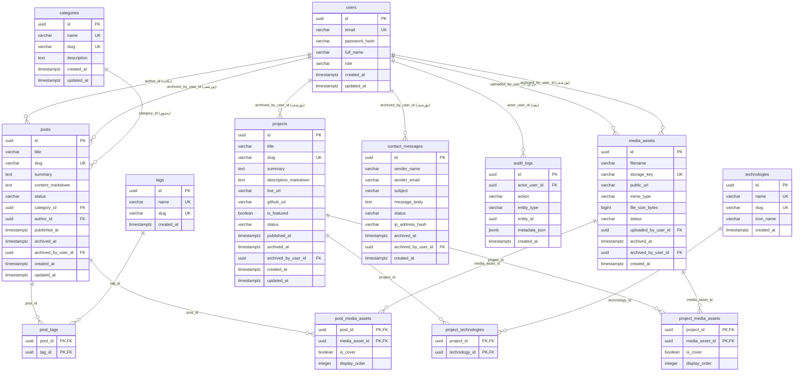

# مخطط كيانات وعلاقات قاعدة البيانات (Entity Relationship Diagram - ERD)

## 1. نظرة عامة

يقدم هذا المستند المخطط البصري الهيكلي لجميع الجداول الـ 13 المعتمدة في منصة الموقع الشخصي، موضحاً المفاتيح الرئيسية (PK)، المفاتيح الأجنبية (FK)، ودرجات العلاقات (Cardinality) بين الجداول.

---

## 2. مخطط العلاقات الإجمالي (Mermaid ER Diagram)

---

## 3. ملخص العلاقات ودرجات التعدد (Relationships & Cardinalities Summary)

1. **`users` -> `posts`**: علاقة واحد إلى متعدد (`1:N`). مدير النظام يمكنه كتابة عدة مقالات، وأرشفة عدة مقالات.
2. **`categories` -> `posts`**: علاقة واحد إلى متعدد (`1:N`). التصنيف يحتوي مقالاً واحداً أو أكثر.
3. **`posts` <-> `tags`**: علاقة متعدد إلى متعدد (`N:M`) يتم تمثيلها عبر جدول الوسيط الصريح `post_tags`.
4. **`projects` <-> `technologies`**: علاقة متعدد إلى متعدد (`N:M`) تمثل عبر جدول الوسيط الصريح `project_technologies`.
5. **`posts` <-> `media_assets`**: علاقة متعدد إلى متعدد (`N:M`) تمثل عبر جدول الوسيط الصريح `post_media_assets` لحظر البوليمورفية.
6. **`projects` <-> `media_assets`**: علاقة متعدد إلى متعدد (`N:M`) تمثل عبر جدول الوسيط الصريح `project_media_assets` لحظر البوليمورفية.
7. **`users` -> `audit_logs`**: علاقة واحد إلى متعدد (`1:N`). كل سجل تدقيق يرتبط صراحة بالمستخدم الذي نفذ العملية.
