# خريطة الموقع الهيكلية (Site Map Specification)

## 1. نظرة عامة

توضح هذه الوثيقة الهيكل الكامل لمسارات منصة الموقع الشخصي المتقدم، مقسمة إلى منطقة الزوار العامة (Public Area) والمنطقة الإدارية المحمية (Protected Admin Area)، بالإضافة إلى حالة عدم الوجود على مستوى الإطار (Framework-level Not-Found State).

---

## 2. مخطط خريطة الموقع (Site Map Mermaid Diagram)

```mermaid
graph TD
    Root["/ (الصفحة الرئيسية Home)"]

    %% Public Routes
    subgraph Public_Area ["المنطقة العامة (Public Area)"]
        Root --> About["/about (عن المطور)"]
        Root --> Services["/services (الخدمات)"]
        Root --> Projects["/projects (المشاريع)"]
        Projects --> ProjectDetail["/projects/[slug] (تفاصيل المشروع)"]
        Root --> Blog["/blog (المدونة التقنية)"]
        Blog --> PostDetail["/blog/[slug] (تفاصيل المقال)"]
        Root --> Contact["/contact (التواصل)"]
    end

    %% Framework-level Not Found State
    subgraph Framework_State ["حالة عدم الوجود (System State)"]
        NotFoundState["app/not-found.tsx (حالة 404 عند عدم وجود المسار أو المورد)"]
    end

    %% Protected Admin Routes
    subgraph Admin_Area ["المنطقة الإدارية المحمية (Protected Admin Area)"]
        Root --> AdminLogin["/admin/login (تسجيل الدخول الإداري)"]
        AdminLogin --> AdminDashboard["/admin (لوحة التحكم الرئيسية)"]
        AdminDashboard --> AdminPosts["/admin/posts (إدارة المقالات)"]
        AdminDashboard --> AdminProjects["/admin/projects (إدارة المشاريع)"]
        AdminDashboard --> AdminMedia["/admin/media (إدارة الوسائط والأصول)"]
        AdminDashboard --> AdminMessages["/admin/messages (رسائل التواصل الواردة)"]
        AdminDashboard --> AdminAudit["/admin/audit (سجلات التدقيق الإداري)"]
    end

    %% Routing Triggers to Not-Found
    Public_Area -. "عند طلب مسار/مورد غير موجود" .-> NotFoundState

    %% Styles
    classDef publicStyle fill:#1e293b,stroke:#38bdf8,stroke-width:2px,color:#fff;
    classDef adminStyle fill:#312e81,stroke:#818cf8,stroke-width:2px,color:#fff;
    classDef rootStyle fill:#0f172a,stroke:#f59e0b,stroke-width:3px,color:#fff;
    classDef stateStyle fill:#450a0a,stroke:#f87171,stroke-width:2px,color:#fff;

    class Root rootStyle;
    class About,Services,Projects,ProjectDetail,Blog,PostDetail,Contact publicStyle;
    class AdminLogin,AdminDashboard,AdminPosts,AdminProjects,AdminMedia,AdminMessages,AdminAudit adminStyle;
    class NotFoundState stateStyle;
```

---

## 3. وصف المسارات وقواعد الصلاحية

| المسار (Route)      | نوع الوصول (Access)         | الغرض والوصف                                                                                  |
| ------------------- | --------------------------- | --------------------------------------------------------------------------------------------- |
| `/`                 | عام (Public)                | الصفحة الرئيسية وتتضمن الـ Hero (3D خفيف) وملخص الخدمات والمشاريع المميزة.                    |
| `/about`            | عام (Public)                | السيرة الذاتية البرمجية، المهارات التقنية، والخبرات.                                          |
| `/services`         | عام (Public)                | تفاصيل الخدمات البرمجية والهندسية المقدمة.                                                    |
| `/projects`         | عام (Public)                | معرض كافة المشاريع مع إمكانية التصفية حسب التقنية المستعملة.                                  |
| `/projects/[slug]`  | عام (Public)                | الصفحة التفصيلية لمشروع محدد مع عرض المعرض والروابط الحية.                                    |
| `/blog`             | عام (Public)                | قائمة المقالات التقنية المنشورة مع تصفية حسب التصنيفات والوسوم.                               |
| `/blog/[slug]`      | عام (Public)                | قراءة مقال تقني مخصص مع جدول المحتويات وتظليل الأكواد البرمجية.                               |
| `/contact`          | عام (Public)                | نموذج تواصل آمن مع حماية ضد السبام والـ Rate Limiting.                                        |
| `app/not-found.tsx` | حالة نظام (Framework State) | واجهة 404 مخصصة يُعالجها التالي تلقائياً عند طلب مسار غير موجود أو مورد محذوف (`notFound()`). |
| `/admin/login`      | عام (Public)                | بوابة الدخول المحمية الخاصة بالأدمن فقط مع حماية ضد التخمين والجلسات.                         |
| `/admin`            | محمي (Admin Only)           | لوحة القيادة الإدارية مع العدادات والإحصائيات وتدفق العمليات.                                 |
| `/admin/posts`      | محمي (Admin Only)           | إنشاء وتعديل وحذف ونشر المقالات التقنية مع إعادة تنشيط الكاش (Cache Revalidation).            |
| `/admin/projects`   | محمي (Admin Only)           | إدارة معرض المشاريع وبياناتها والوسوم والروابط.                                               |
| `/admin/media`      | محمي (Admin Only)           | طلب روابط رفع مباشرة (Presigned URLs) وتأكيد تسجيل الأصول والميديا.                           |
| `/admin/messages`   | محمي (Admin Only)           | استعراض ورسائل الوارد وتغيير حالتها أو حذفها (وفق سياسة Retention).                           |
| `/admin/audit`      | محمي (Admin Only)           | استعراض سجلات التدقيق للأفعال الإدارية المتخذة داخل النظام.                                   |
