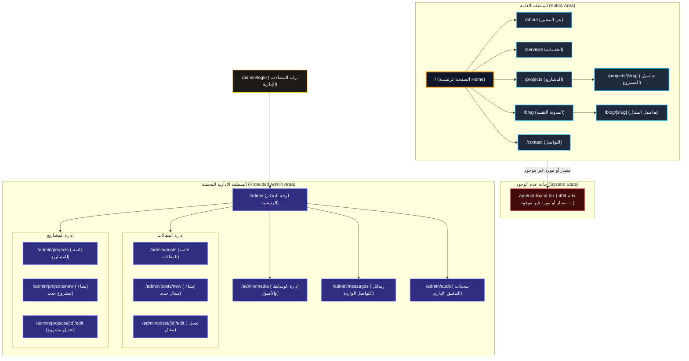

# خريطة الموقع الهيكلية (Site Map Specification)

## 1. نظرة عامة

توضح هذه الوثيقة الهيكل الكامل لمسارات منصة الموقع الشخصي المتقدم، مقسمة إلى منطقة الزوار العامة (Public Area) والمنطقة الإدارية المحمية (Protected Admin Area).

---

## 2. مخطط خريطة الموقع (Site Map Mermaid Diagram)

---

## 3. وصف المسارات وقواعد الصلاحية

| المسار (Route) | نوع الوصول (Access) | الغرض والوصف |
| --- | --- | --- |
| `/` | عام (Public) | الصفحة الرئيسية وتتضمن الـ Hero (3D خفيف) وملخص الخدمات والمشاريع المميزة. |
| `/about` | عام (Public) | السيرة الذاتية البرمجية، المهارات التقنية، والخبرات. |
| `/services` | عام (Public) | تفاصيل الخدمات البرمجية والهندسية المقدمة. |
| `/projects` | عام (Public) | معرض كافة المشاريع مع إمكانية التصفية حسب التقنية المستعملة. |
| `/projects/[slug]` | عام (Public) | الصفحة التفصيلية لمشروع محدد مع عرض المعرض والروابط الحية. |
| `/blog` | عام (Public) | قائمة المقالات التقنية المنشورة مع تصفية حسب التصنيفات والوسوم. |
| `/blog/[slug]` | عام (Public) | قراءة مقال تقني مخصص مع جدول المحتويات وتظليل الأكواد البرمجية. |
| `/contact` | عام (Public) | نموذج تواصل آمن مع حماية ضد السبام والـ Rate Limiting. |
| `app/not-found.tsx` | حالة نظام (Framework State) | واجهة 404 مخصصة تُطلق تلقائياً عند طلب مسار غير موجود أو مورد محذوف. |
| `/admin/login` | بوابة مصادقة (Auth Entry) | نقطة دخول المصادقة الإدارية؛ لا تُعرض في قوائم التنقل العامة. |
| `/admin` | محمي (Admin Only) | لوحة القيادة الإدارية مع العدادات والإحصائيات. |
| `/admin/posts` | محمي (Admin Only) | قائمة المقالات مع خيارات الحالة (مسودة/منشور/مؤرشف). |
| `/admin/posts/new` | محمي (Admin Only) | نموذج إنشاء مقال تقني جديد. |
| `/admin/posts/[id]/edit` | محمي (Admin Only) | نموذج تعديل مقال قائم. |
| `/admin/projects` | محمي (Admin Only) | قائمة المشاريع مع خيارات التصفية والتعديل. |
| `/admin/projects/new` | محمي (Admin Only) | نموذج إنشاء مشروع جديد. |
| `/admin/projects/[id]/edit` | محمي (Admin Only) | نموذج تعديل مشروع قائم. |
| `/admin/media` | محمي (Admin Only) | طلب روابط رفع Presigned URLs وإدارة مكتبة الأصول. |
| `/admin/messages` | محمي (Admin Only) | استعراض رسائل الوارد وتغيير حالتها (مقروءة/مؤرشفة). |
| `/admin/audit` | محمي (Admin Only) | استعراض سجلات التدقيق الإداري غير القابلة للتعديل. |
