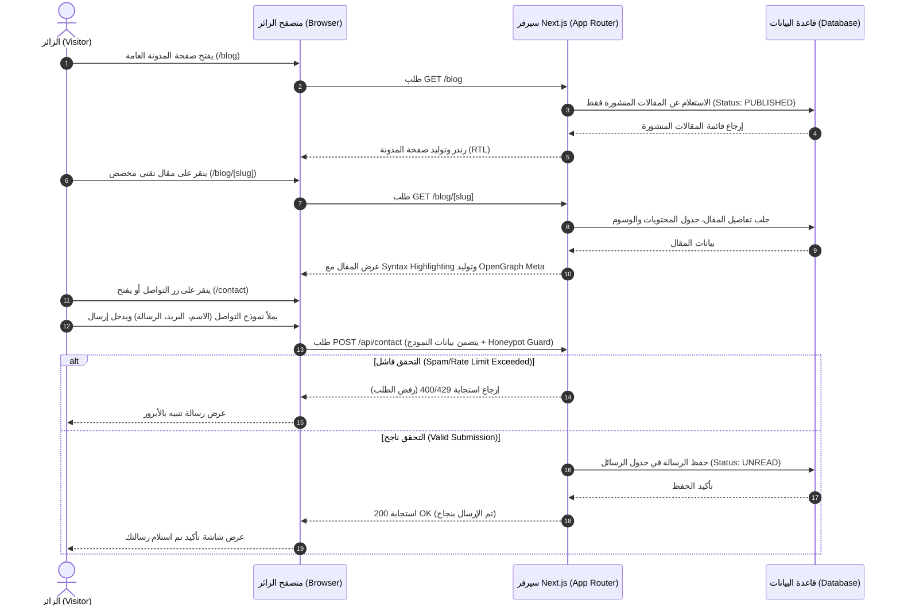
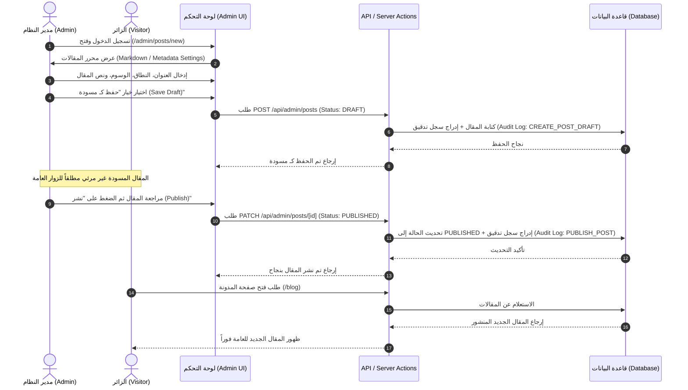
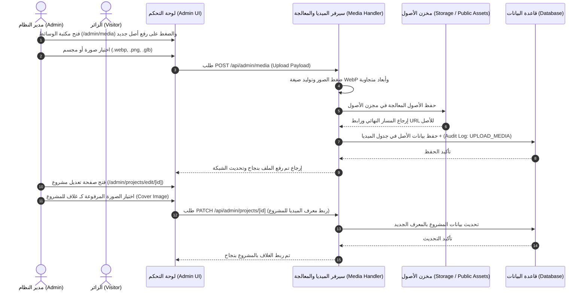

# تدفقات المستخدم الرئيسية (User Flows Specification)

## 1. نظرة عامة

تحدد هذه الوثيقة تدفقات العمليات البرمجية والتفاعلية لكل من الزائر (Visitor) ومدير النظام (Admin) على منصة الموقع الشخصي المتقدم.

---

## 2. التدفق الأول: الزائر يقرأ مقالاً ويتواصل مع المطور (Visitor Post Reading & Contact Flow)

---

## 3. التدفق الثاني: الأدمن ينشئ ويراجع وينشر مقالاً (Admin Post Creation & Publishing Flow)

---

## 4. التدفق الثالث: الأدمن يرفع أصلاً صورياً ويربطه بمشروع أو مقال (Media Upload & Attachment Flow)

