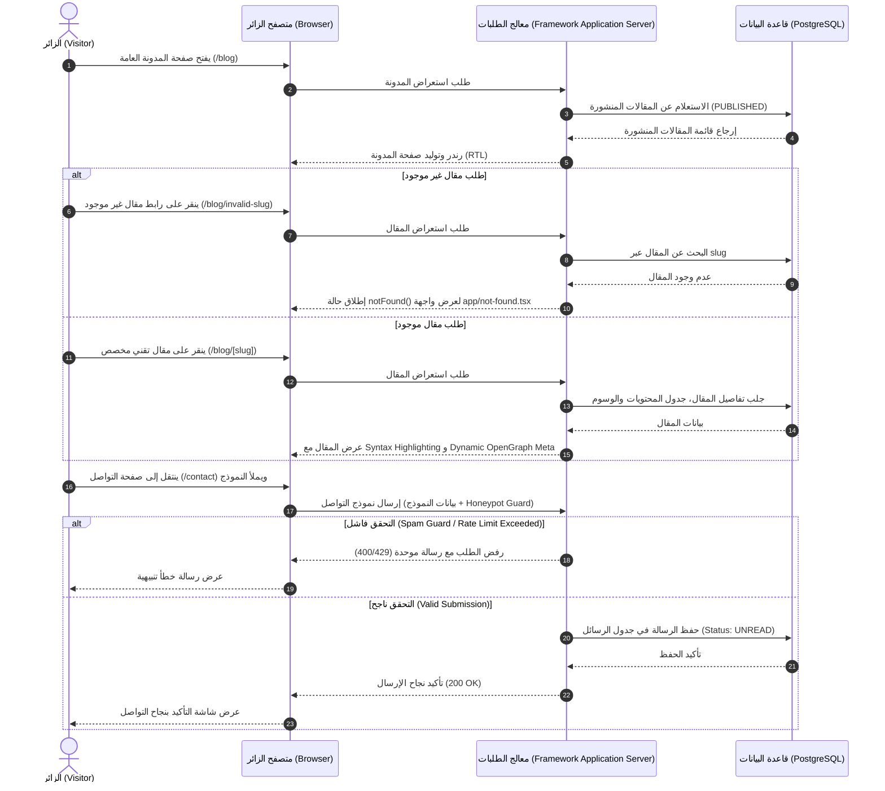
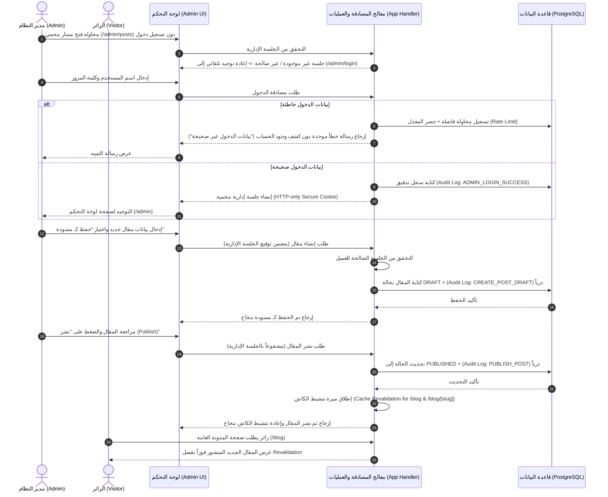
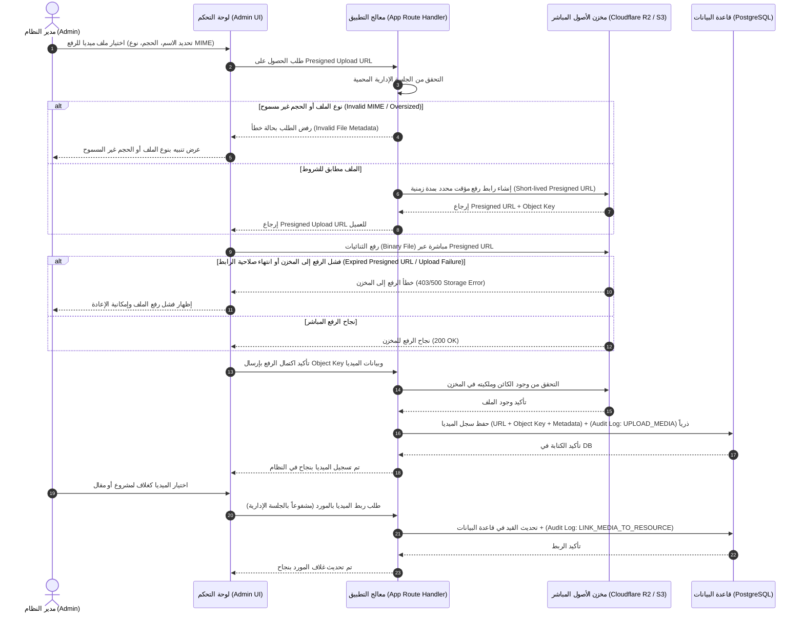

# تدفقات المستخدم الرئيسية (User Flows Specification)

## 1. نظرة عامة

تحدد هذه الوثيقة تدفقات العمليات البرمجية والتفاعلية لكل من الزائر (Visitor) ومدير النظام (Admin) على منصة الموقع الشخصي المتقدم، مع الالتزام التام بنمط الرفع المباشر عبر Presigned URLs وحماية الجلسات الإدارية وإعادة تنشيط الكاش (Cache Revalidation).

---

## 2. التدفق الأول: الزائر يقرأ مقالاً ويتواصل مع المطور (Visitor Post Reading & Contact Flow)

---

## 3. التدفق الثاني: مصادقة الأدمن، إنشاء المقال ونشره مع تنشيط الكاش (Admin Auth, Post Lifecycle & Revalidation)

---

## 4. التدفق الثالث: رفع الميديا المباشر عبر Presigned URL والربط بالمحتوى (Direct Presigned Media Upload Flow)

